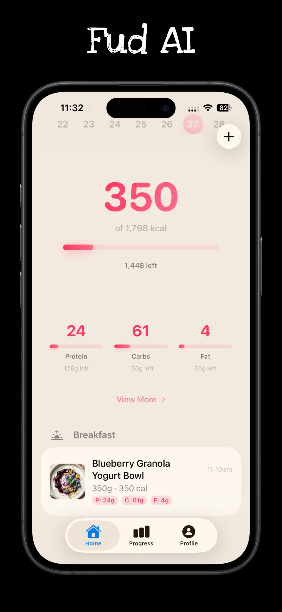
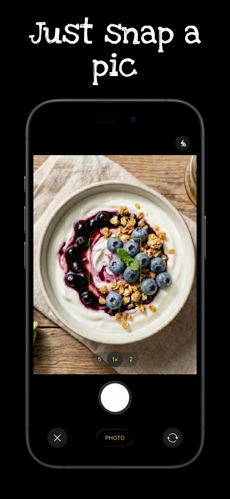
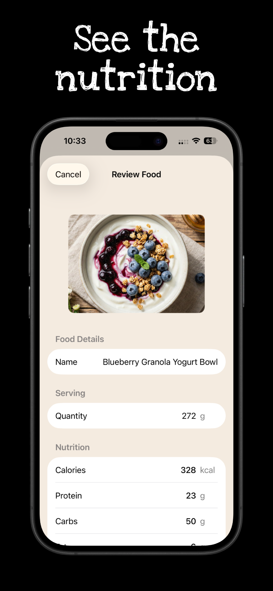
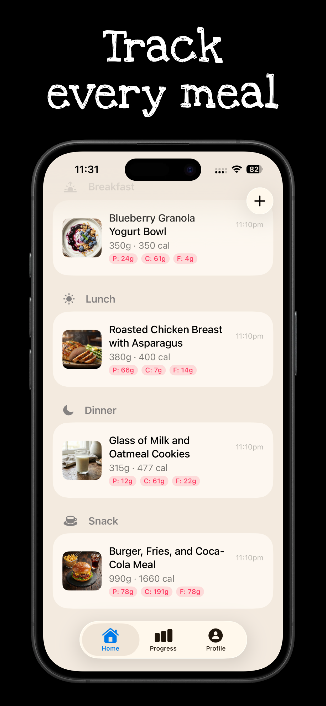

<p align="center">
  
</p>

<h1 align="center">Fud AI</h1>

<p align="center">
  <strong>Eat Smart, Live Better</strong><br>
  Just snap, track, and thrive. Your nutrition, simplified.
</p>

<p align="center">
  
  
  
  
  
  
</p>

---

Fud AI is an AI-powered calorie and nutrition tracker for iOS. Snap a photo of your food or nutrition label, and Gemini 2.5 Flash instantly identifies the item and estimates its full nutritional breakdown — calories, macros, and 9 micronutrients. No barcode databases, no manual searching. Just point, shoot, and log.

---

## Table of Contents

- [Features](#features)
- [Screenshots](#screenshots)
- [How It Works](#how-it-works)
- [Nutrition Tracking](#nutrition-tracking)
- [Apple Health Integration](#apple-health-integration)
- [iCloud Sync](#icloud-sync)
- [Subscription Plans](#subscription-plans)
- [Architecture & Developer Guide](#architecture--developer-guide)
- [Build & Run](#build--run)
- [Privacy Policy](#privacy-policy)
- [Terms of Service](#terms-of-service)
- [License](#license)
- [Contact](#contact)

---

## Features

### AI Food Recognition
- **Snap Food** — Take a photo of any meal and get instant calorie and macro estimates
- **Nutrition Label Scan** — Photograph a nutrition facts panel for precise per-serving data
- **Photo Library** — Analyze existing photos from your camera roll
- **Text Input** — Type a brand, food name, and quantity for AI-powered nutrition lookup

### Comprehensive Nutrition Tracking
- Track **13 nutrients** per entry: calories, protein, carbs, fat, sugar, added sugar, fiber, saturated fat, monounsaturated fat, polyunsaturated fat, cholesterol, sodium, and potassium
- Adjustable **serving sizes** with real-time nutrition recalculation
- Organize entries by **meal type** (Breakfast, Lunch, Dinner, Snack, Other)
- Browse past days with a **date selector**

### Smart Dashboard
- Daily calorie hero display with progress bar
- Macro cards for protein, carbs, and fat with gradient visuals
- Detailed nutrition breakdown view
- Food log grouped by meal type with swipe-to-delete

### Progress & Analytics
- **Weight chart** with trend visualization
- **Calorie trend chart** showing daily intake vs. goal
- **Macro averages** over selected time range
- **Streak tracking** — current streak, best streak, days on target
- Time range filters: Week, Month, Year, All Time

### Personalized Plans
- 24-step onboarding that collects your gender, age, height, weight, body fat %, activity level, goals, and dietary preferences
- **BMR calculation** using Katch-McArdle (with body fat) or Mifflin-St Jeor
- **TDEE** with 6 activity level multipliers (1.2x - 2.0x)
- Auto-calculated daily targets for calories, protein, carbs, and fat
- Fully customizable — override any calculated value

### Apple Health Integration
- **Writes** all 12 nutrition data types to Apple Health per food entry
- **Writes** body mass, height, and body fat percentage
- **Reads** weight, height, body fat, date of birth, and biological sex
- **Bidirectional sync** — profile updates when Health data changes
- Background observer for real-time measurement sync

### iCloud Sync
- Food entries, weight entries, and user profile sync to your private iCloud database
- Automatic sync on every add, delete, and profile save
- Returning users can restore all data on a new device during onboarding
- Sign in with Apple for secure authentication

### Smart Notifications
- Customizable **meal reminders** for breakfast, lunch, and dinner
- **Streak protection** — reminds you to log food before your streak breaks
- **Daily summary** — shows calories consumed vs. remaining

### Learn
- 11 educational articles on nutrition, weight loss science, macronutrients, AI tracking, and more
- Category filtering (Nutrition, Science, Lifestyle, Technology)
- Search and sort functionality
- Reading time estimates

### Additional
- **Dark mode** with system, light, and dark appearance options
- **Metric and imperial** unit support
- **Scratch card gamification** during onboarding for subscription discounts
- **Delete all data** option for full account removal (local + cloud)

---

## Screenshots

| Home | Snap Food | Nutrition | Meal Log |
|:---:|:---:|:---:|:---:|
|  |  |  |  |

---

## How It Works

```
User captures photo ──> Gemini 2.5 Flash AI ──> JSON nutrition response
                                                        │
                        User reviews & edits  <─────────┘
                                │
                        FoodStore.addEntry()
                                │
                  ┌─────────────┼─────────────┐
                  │             │              │
            UserDefaults    CloudKit     Apple Health
            (local JSON)   (iCloud)     (if enabled)
```

1. **Capture** — Snap a photo, scan a label, pick from library, or type food details
2. **Analyze** — Gemini 2.5 Flash identifies the food and estimates full nutrition
3. **Review** — Edit the name, adjust serving size, and confirm meal type
4. **Log** — Entry is saved locally, synced to iCloud, and written to Apple Health
5. **Track** — Dashboard and progress charts update in real time via `@Observable`

---

## Nutrition Tracking

### Macronutrients (always tracked)
| Nutrient | Unit |
|----------|------|
| Calories | kcal |
| Protein | g |
| Carbohydrates | g |
| Fat | g |

### Micronutrients (AI-estimated when available)
| Nutrient | Unit |
|----------|------|
| Sugar | g |
| Added Sugar | g |
| Fiber | g |
| Saturated Fat | g |
| Monounsaturated Fat | g |
| Polyunsaturated Fat | g |
| Cholesterol | mg |
| Sodium | mg |
| Potassium | mg |

### Calorie & Macro Calculation

| Formula | Method |
|---------|--------|
| **BMR** | Katch-McArdle (if body fat known) or Mifflin-St Jeor |
| **TDEE** | BMR x activity multiplier (1.2 - 2.0) |
| **Daily Calories** | max(1200, TDEE + weeklyChangeKg x 7700 / 7) |
| **Protein** | activityLevel.proteinPerKg x weightKg (1.0 - 2.2 g/kg) |
| **Fat** | 0.6 x weightKg |
| **Carbs** | (dailyCalories - protein x 4 - fat x 9) / 4 |

---

## Apple Health Integration

### Data Written
- Dietary Energy, Protein, Carbohydrates, Fat, Sugar, Fiber
- Saturated Fat, Monounsaturated Fat, Polyunsaturated Fat
- Cholesterol, Sodium, Potassium
- Body Mass, Height, Body Fat Percentage

### Data Read
- Body Mass, Height, Body Fat Percentage
- Date of Birth, Biological Sex

Health data is written per food entry with timestamps and tracked by UUID for accurate deletion. A background observer monitors Health for external weight/height/body fat changes and syncs them back to the app.

---

## iCloud Sync

| Data | Synced | Notes |
|------|--------|-------|
| Food Entries | Yes | Excludes image data (stored locally only) |
| Weight Entries | Yes | Full bidirectional sync |
| User Profile | Yes | Single record, overwritten on save |
| Food Photos | No | Too large for CloudKit |

- **Container:** `iCloud.com.apoorvdarshan.calorietracker`
- **Database:** Private CloudKit database (only accessible to the signed-in user)
- **Merge strategy:** By UUID — cloud records replace local duplicates
- **Batch size:** Up to 400 records per sync operation

---

## Subscription Plans

| Plan | Price | Scans | Product ID |
|------|-------|-------|------------|
| **Free** | $0 | 3 total | — |
| **Monthly** | $7.99/mo | 25/day | `fudai.subscription.monthly` |
| **Yearly** | $29.99/yr ($2.50/mo) | 25/day | `fudai.subscription.yearly` |
| **Yearly Discount** | $21.99/yr ($1.83/mo) | 25/day | `fudai.subscription.yearly.discount` |

- Auto-renewable subscriptions via StoreKit 2
- Daily scan counter resets at midnight
- Restore Purchases available in profile and paywall screens
- Cancel anytime through iOS subscription management

---

## Architecture & Developer Guide

### Tech Stack
- **Language:** Swift 5
- **UI:** SwiftUI (iOS 26.2+)
- **AI:** Google Gemini 2.5 Flash API
- **Storage:** UserDefaults (local), CloudKit (cloud), HealthKit (health)
- **Payments:** StoreKit 2
- **Auth:** Sign in with Apple (ASAuthorization)
- **Dependencies:** Zero external dependencies

### Key Patterns

| Pattern | Details |
|---------|---------|
| `@Observable` macro | Not `ObservableObject`. Inject with `.environment()`, consume with `@Environment(Type.self)` |
| Main actor isolation | `SWIFT_DEFAULT_ACTOR_ISOLATION = MainActor` — no manual `@MainActor` needed |
| File discovery | `PBXFileSystemSynchronizedRootGroup` — Xcode auto-discovers new files, never edit pbxproj |
| Stateless services | `GeminiService` and `CloudKitService` are pure structs with static methods |
| Secrets management | `Secrets.plist` (gitignored) loaded via `APIKeyManager` |

### Environment Objects (injected at app root)

| Object | Purpose |
|--------|---------|
| `FoodStore` | Food entry CRUD, daily totals, streak calculation |
| `WeightStore` | Weight entry CRUD, trend data |
| `NotificationManager` | Local notification scheduling and permissions |
| `AuthManager` | Apple Sign-In, user identity |
| `HealthKitManager` | Apple Health read/write, background observers |
| `StoreManager` | StoreKit 2 subscriptions, scan limits, paywall state |

### Source Layout

```
calorietracker/
├── calorietrackerApp.swift      # App entry point, environment setup
├── ContentView.swift            # 4-tab layout, HomeView, ProfileView inline
├── Models/
│   ├── UserProfile.swift        # BMR/TDEE/macro calculations
│   ├── FoodEntry.swift          # Logged food item with 13 nutrients
│   ├── Article.swift            # Educational article content
│   └── WeightEntry.swift        # Weight log entry
├── Views/
│   ├── OnboardingView.swift     # 24-step onboarding flow
│   ├── FoodResultView.swift     # AI result review & edit screen
│   ├── LearnView.swift          # Educational articles browser
│   ├── PaywallView.swift        # Subscription purchase screen
│   ├── SpinWheelView.swift      # Scratch card discount reveal
│   ├── HomeComponents/          # Week strip, macro cards, nutrition detail
│   ├── ProgressComponents/      # Charts, streak stats, weight tracking
│   └── Theme/                   # AppColors, gradients, design tokens
├── Services/
│   ├── GeminiService.swift      # Gemini 2.5 Flash API integration
│   ├── APIKeyManager.swift      # Secrets.plist loader
│   ├── AuthManager.swift        # Apple Sign-In wrapper
│   └── CloudKitService.swift    # iCloud private database sync
└── Stores/
    ├── FoodStore.swift           # @Observable food entry store
    ├── WeightStore.swift         # @Observable weight entry store
    ├── NotificationManager.swift # @Observable notification scheduler
    ├── HealthKitManager.swift    # @Observable Apple Health bridge
    └── StoreManager.swift        # @Observable StoreKit 2 manager
```

### Data Flow

```
Photo/Text Input
      │
      ▼
GeminiService.autoAnalyze() ──> Gemini 2.5 Flash API
      │
      ▼
FoodAnalysis (parsed JSON)
      │
      ▼
FoodResultView (user review/edit)
      │
      ▼
FoodStore.addEntry()
      │
      ├──> UserDefaults (local persistence)
      ├──> CloudKitService.saveFoodEntry() (iCloud sync)
      └──> HealthKitManager.writeNutrition() (Apple Health)
```

### Build & Run

```bash
# Build for simulator
xcodebuild -scheme calorietracker \
  -destination 'platform=iOS Simulator,name=iPhone 17 Pro' build

# Build for physical device
xcodebuild -scheme calorietracker \
  -destination 'id=00008140-000C02942169801C' build
```

### API Key Setup

1. Create `calorietracker/Secrets.plist`
2. Add a key `GEMINI_API_KEY` with your Gemini API key as the value
3. The file is gitignored — never commit API keys

---

## Privacy Policy

Read our full privacy policy: **[Privacy Policy](https://fud-ai.vercel.app/privacy.html)**

---

## Terms of Service

Read our full terms of service: **[Terms of Service](https://fud-ai.vercel.app/terms.html)**

---

## License

Copyright (c) 2026 Apoorv Darshan. All Rights Reserved.

See [LICENSE](LICENSE) for details.

---

## Contact

- **Developer:** Apoorv Darshan
- **Developer Email:** ad13dtu@gmail.com
- **App Support:** info.fudai@gmail.com
- **Issues:** [GitHub Issues](../../issues)
